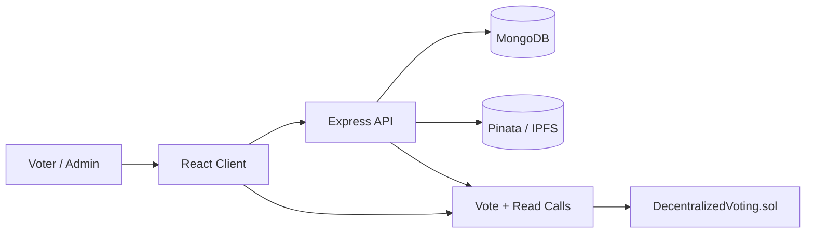

# JanChain Voting

JanChain Voting is a complete end-to-end decentralized voting platform built with React, Express, MongoDB, Solidity, Hardhat, and MetaMask. It combines off-chain identity and election metadata with on-chain vote integrity, giving administrators the tools to manage elections while keeping the actual vote ledger tamper-resistant and publicly verifiable.

## What This Includes

- Voter registration and login with JWT authentication
- Optional wallet linking and wallet-based login using signed challenges
- Explicit wallet verification flow before blockchain voting is enabled
- Admin approval flow for eligible voters
- Manual wallet resync from the admin console when blockchain state needs reconciliation
- Smart-contract-enforced one-wallet-one-vote logic
- Restricted elections (approved voter registry) and open polls (any verified wallet)
- Gasless voting: voters sign an EIP-712 ballot and the server relays it, paying the gas
- Election creation with categories, candidate management, time-based voting windows, extension, and manual closure
- Emergency pause that stops every voting path on-chain
- Bulk voter approval, voter search and filters in the admin console
- Real-time results sourced from blockchain reads, with turnout, tie detection, and a public ballot ledger
- Vote verification by wallet address and a per-voter "My ballots" receipt list
- Optional IPFS metadata upload through Pinata
- Hardhat unit tests, client UI test, linting, and production client build

## Tech Stack

- Blockchain: Solidity, Hardhat, OpenZeppelin, Ethers
- Backend: Node.js, Express, MongoDB, JWT, Zod
- Frontend: React, Vite, Tailwind CSS 4, React Router, Sonner
- Wallet: MetaMask
- Optional storage: Pinata/IPFS

## Architecture



### Core flow

1. A voter registers with email/password and optionally a wallet address.
2. An admin approves the voter in the backend.
3. If a wallet is linked, the backend can also approve that wallet on-chain.
4. The admin creates an election in the backend.
5. The backend optionally uploads metadata to IPFS, then creates the election on-chain.
6. The voter opens the election page, connects MetaMask, and either signs a gasless ballot that the API relays or sends the vote transaction directly.
7. The frontend and backend read live results from the chain and show verification details.

## Project Structure

```text
.
├── client
│   ├── src
│   │   ├── api
│   │   ├── blockchain
│   │   ├── components
│   │   ├── context
│   │   ├── hooks
│   │   ├── lib
│   │   ├── pages
│   │   ├── routes
│   │   ├── styles
│   │   └── tests
├── contracts
│   └── DecentralizedVoting.sol
├── deployments
├── docs
│   └── JanChainVoting.postman_collection.json
├── scripts
│   ├── deploy.js
│   └── export-artifacts.js
├── server
│   └── src
│       ├── blockchain
│       ├── config
│       ├── constants
│       ├── controllers
│       ├── middleware
│       ├── models
│       ├── routes
│       ├── seed
│       ├── services
│       ├── utils
│       └── validators
└── test
    └── DecentralizedVoting.test.js
```

## Smart Contract Design

`DecentralizedVoting.sol` uses role-based access control from OpenZeppelin:

- `DEFAULT_ADMIN_ROLE`: contract owner
- `ELECTION_ADMIN_ROLE`: may create, extend, and end elections
- `VOTER_APPROVER_ROLE`: may approve wallets for voting

### Contract features

- `createElection(...)`: creates a new election with candidate names and optional image URIs
- `approveVoter(...)` and `approveVoters(...)`: manages voter eligibility on-chain
- `createElection(..., restricted)`: `restricted = true` requires the approved voter registry, `false` makes an open poll
- `castVote(...)`: records exactly one vote per eligible wallet per election
- `castVoteBySig(...)`: records a vote from an EIP-712 signed `Ballot(electionId, candidateId, voter, deadline)`; anyone may relay it, but the signature binds the choice
- `endElection(...)` and `extendElection(...)`: manual closure or a later end time
- `pause()` / `unpause()`: emergency stop for all voting (`DEFAULT_ADMIN_ROLE`)
- `getElection(...)`, `getElections(offset, limit)`, `getElectionCandidates(...)`, `getVoteReceipt(...)`, `canVote(...)`: read methods for the UI/API

### Security and gas notes

- Custom errors reduce revert gas costs
- `uint48`, `uint16`, and `uint96` are used to keep packed storage efficient
- `calldata` and `unchecked` increments reduce overhead in loops
- Voting windows are enforced by `block.timestamp`
- Double voting is blocked through `hasVoted[electionId][wallet]`, which also makes signed ballots non-replayable
- Signed ballots carry a deadline; the client signs with a 10-minute validity window

## REST API Overview

### Auth

- `POST /api/auth/register`
- `POST /api/auth/login`
- `GET /api/auth/me`
- `POST /api/auth/wallet/challenge`
- `POST /api/auth/wallet/verify`

### Elections

- `GET /api/elections` (`q`, `status`, `category` filters)
- `GET /api/elections/stats`
- `GET /api/elections/me/ballots` (auth)
- `GET /api/elections/:electionId`
- `GET /api/elections/:electionId/results`
- `GET /api/elections/:electionId/activity`
- `GET /api/elections/:electionId/verify/:walletAddress`
- `POST /api/elections/:electionId/relay-vote` (auth, rate limited): relays a signed ballot for the caller's verified wallet

### Admin

- `GET /api/admin/dashboard`
- `GET /api/admin/users` (`q`, `status` = `all` | `pending` | `approved` | `unverified`)
- `PATCH /api/admin/users/:userId/approval`
- `POST /api/admin/users/bulk-approval`
- `POST /api/admin/users/:userId/sync-wallet`
- `POST /api/admin/elections`
- `PATCH /api/admin/elections/:electionId/end`
- `PATCH /api/admin/elections/:electionId/extend`
- `POST /api/admin/system/pause`

## Frontend Pages

- `/` Home page
- `/login` Login/Register page
- `/dashboard` Voter dashboard
- `/elections` Election list
- `/elections/:electionId` Voting page
- `/results/:electionId` Results and vote verification
- `/admin` Admin control panel

## Local Development

### Prerequisites

- Node.js 20+
- MongoDB running locally or via Atlas
- MetaMask browser extension

### Environment files

This repo ships with examples:

- [`.env.example`](./.env.example)
- [`server/.env.example`](./server/.env.example)
- [`client/.env.example`](./client/.env.example)

For local development, set:

- Root: deployer RPC/private key values only when you want testnet deployment
- Server:
  - `MONGODB_URI`
  - `JWT_SECRET`
  - `RPC_URL=http://127.0.0.1:8545`
  - `CHAIN_ID=31337`
  - `CONTRACT_ADDRESS=<deployed contract>`
  - `SERVER_WALLET_PRIVATE_KEY=<Hardhat account #0 private key for local admin writes>`. This wallet also pays gas for relayed (gasless) ballots, so keep it funded on testnets. Without it, voters can still vote by paying their own gas.
- Client:
- `VITE_API_URL=http://localhost:5000/api`
- `VITE_CONTRACT_ADDRESS=<deployed contract>`
- `VITE_CHAIN_ID=31337`
- `VITE_RPC_URL=http://127.0.0.1:8545`

### Run locally

1. Install dependencies:

   ```bash
   npm install
   ```

2. Start a local blockchain in terminal 1:

   ```bash
   npm run node
   ```

3. Deploy the contract in terminal 2:

   ```bash
   npm run deploy:localhost
   npm run sync:abi
   ```

4. Update `server/.env` and `client/.env` with the deployed contract address.
   Add `VITE_RPC_URL=http://127.0.0.1:8545` to the client so MetaMask can add the local Hardhat chain automatically when needed.

5. Start MongoDB.

6. Seed the admin account and sample voters:

   ```bash
   npm run seed
   ```

7. Start the backend:

   ```bash
   npm run dev:server
   ```

8. Start the frontend:

   ```bash
   npm run dev:client
   ```

9. Open `http://localhost:5173`.

### Wallet verification note

Saving a wallet address during registration only stores the address on the voter profile. Before that wallet can vote or be used for wallet login, the voter must sign a verification challenge from the dashboard or voting page. Once verified, an approved wallet can be synced or resynced to the smart contract from the admin console.

## Sample Data

The seed script creates:

- Admin:
  - Email: `admin@civicledger.app`
  - Password: `Admin@12345`
- Sample voters:
  - `ananya.rao@example.com` / `Voter@123`
  - `ravi.sharma@example.com` / `Voter@123`

The seed also uses two default Hardhat wallet addresses:

- `0xf39fd6e51aad88f6f4ce6ab8827279cfffb92266`
- `0x70997970c51812dc3a010c7d01b50e0d17dc79c8`

## Deployment Guide

### Smart contract

- Local: `npm run deploy:localhost`
- Ethereum testnet: `npm run deploy:sepolia`
- Polygon testnet: `npm run deploy:amoy`

After deployment, run:

```bash
npm run sync:abi
```

That copies the compiled ABI into:

- `client/src/blockchain/DecentralizedVoting.json`
- `server/src/blockchain/DecentralizedVoting.json`

### Backend

Recommended platforms:

- Render
- Railway

Required environment variables:

- `MONGODB_URI`
- `JWT_SECRET`
- `RPC_URL`
- `CHAIN_ID`
- `CONTRACT_ADDRESS`
- `SERVER_WALLET_PRIVATE_KEY`
- `CLIENT_URL`

### Frontend

Recommended platforms:

- Vercel
- Netlify

Required environment variables:

- `VITE_API_URL`
- `VITE_CONTRACT_ADDRESS`
- `VITE_CHAIN_ID`
- `VITE_CHAIN_NAME`
- `VITE_BLOCK_EXPLORER_URL`

## Testing and Quality Checks

Verified during this build:

- `npm run compile`
- `npm run test`
- `npm run lint`
- `npm run test --workspace client`
- `npm run build --workspace client`

## Postman

Import [docs/JanChainVoting.postman_collection.json](./docs/JanChainVoting.postman_collection.json) to test the REST API quickly.

## Notes

- Every ballot is signed by the voter in MetaMask. For gasless votes the backend only submits the voter's signed ballot; the contract rejects it if the signature does not match the voter, candidate, and election.
- Contract v2 (open polls, gasless ballots, pause, extension) changes the ABI and the EIP-712 domain, so an existing v1 deployment must be redeployed. `npm run deploy:localhost` re-exports the ABI and updates `CONTRACT_ADDRESS` / `VITE_CONTRACT_ADDRESS` in existing `.env` files. Catalog entries from an older contract address are hidden automatically.
- Admin election creation and voter approval can be synced to the contract through the server wallet.
- IPFS upload is optional and enabled only when `PINATA_JWT` is configured.
- Polygon Mumbai is no longer the preferred Polygon testnet path, so this project uses Polygon Amoy instead.

## Screenshots

The codebase is ready for screenshots, but no browser screenshots were generated in this terminal-only environment. Once the app is running locally, capture:

- Home page
- Login/Register page
- Voter dashboard
- Election list
- Voting page
- Results page
- Admin console
